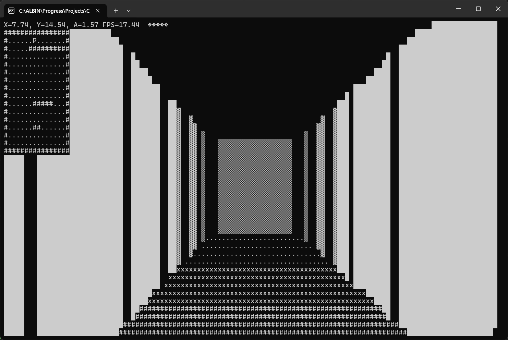
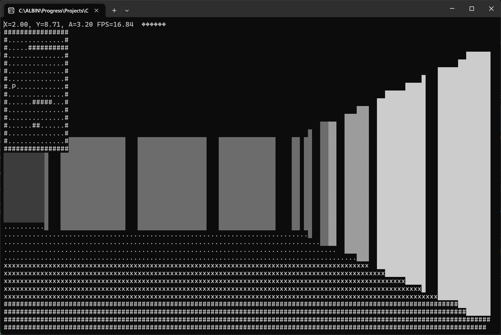

# Console Raycasting Engine

A simple first-person 3D raycasting engine built in **C++** using the **Windows Console API**. The project recreates the rendering technique used in early games such as *Wolfenstein 3D*, producing a pseudo-3D environment entirely within the Windows terminal without relying on graphics libraries.

## Features

- Real-time first-person rendering using raycasting
- Distance-based wall shading for depth perception
- Collision detection against walls
- Smooth player movement and rotation
- Top-down minimap with player position
- FPS counter and player coordinates
- Rendered entirely using Unicode block characters in the console

## Demo






### Controls

| Key | Action |
|-----|--------|
| **W** | Move Forward |
| **S** | Move Backward |
| **A** | Rotate Left |
| **D** | Rotate Right |

## How It Works

For every column of the console window, a ray is cast from the player's position into the map. The engine calculates the distance to the nearest wall and uses that distance to determine:

- Wall height
- Wall shading
- Floor and ceiling rendering
- Boundary highlighting for sharper wall edges

The world is represented as a simple 2D grid, while the raycasting algorithm creates the illusion of a 3D environment.

## Technologies Used

- C++
- Windows Console API (WinAPI)
- Raycasting Algorithm
- Unicode Console Rendering

## Project Structure

```
.
├── Source.cpp      # Main source code
└── README.md
```

## Building

### Requirements

- Windows
- Visual Studio 2022/2026 (or any C++ compiler with WinAPI support)

### Build Steps

1. Clone the repository.

```bash
git clone https://github.com/<your-username>/Console-Raycasting-Engine.git
```

2. Open the project in Visual Studio.

3. Build the solution.

4. Run the executable.

No external libraries are required.

## Learning Outcomes

This project demonstrates:

- Raycasting fundamentals
- Real-time rendering techniques
- Game loop implementation
- Collision detection
- Player movement and camera mathematics
- Console graphics programming using WinAPI

## Acknowledgements

This project was inspired by the rendering techniques used in classic games such as **Wolfenstein 3D** and serves as an educational implementation of a software-based raycasting engine.
Special thanks to **javidx9** for the outstanding raycasting tutorial that inspired this project.